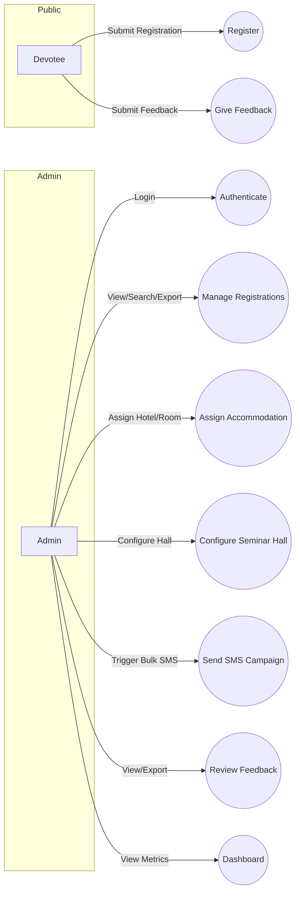
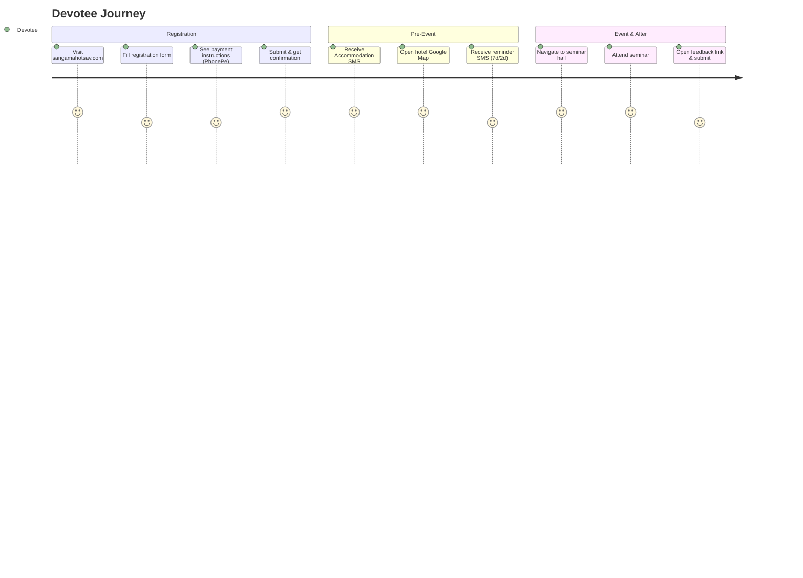
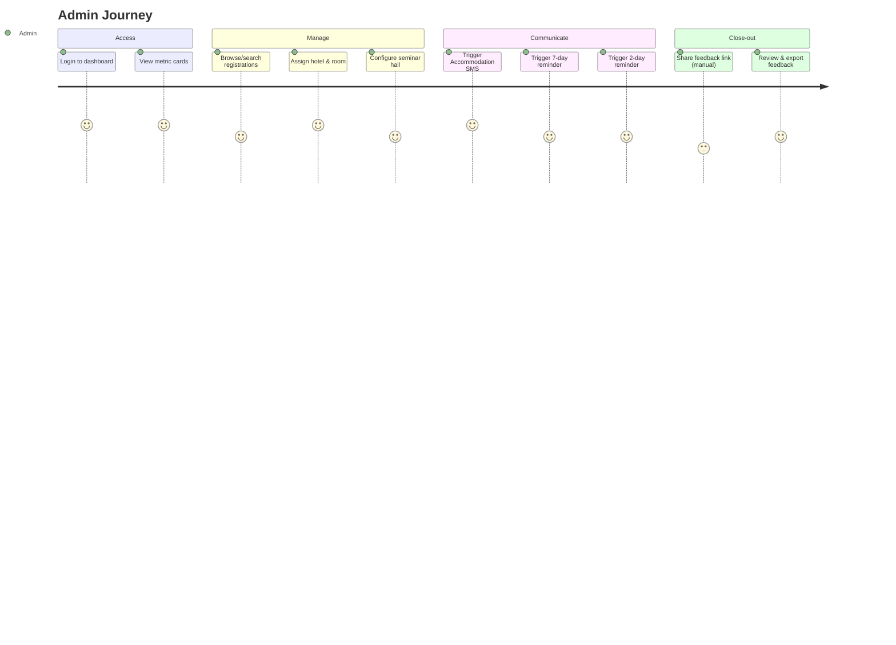
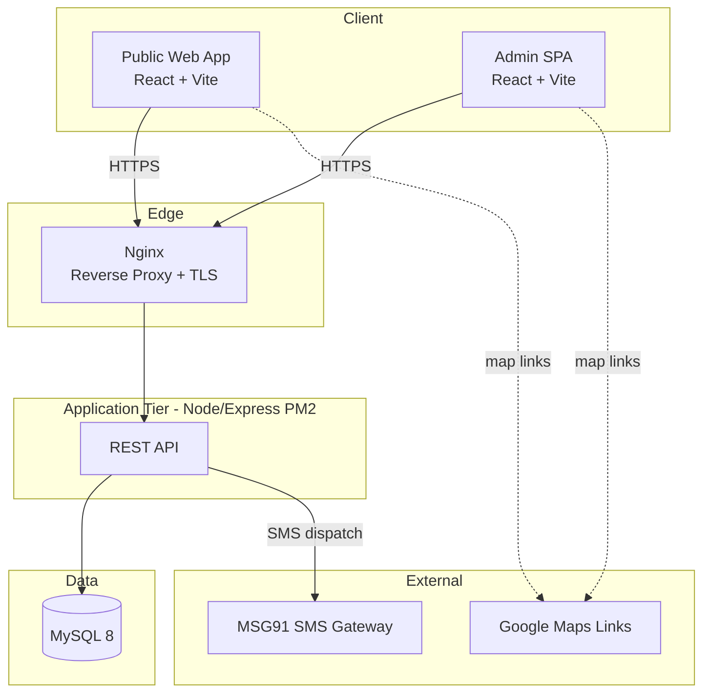
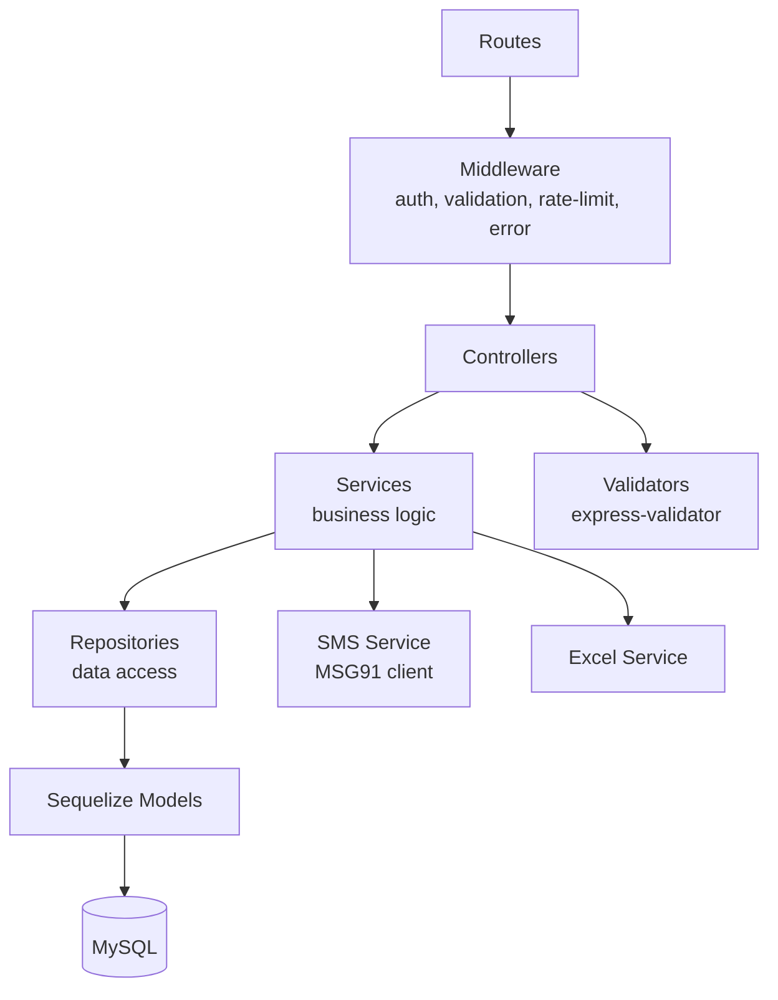
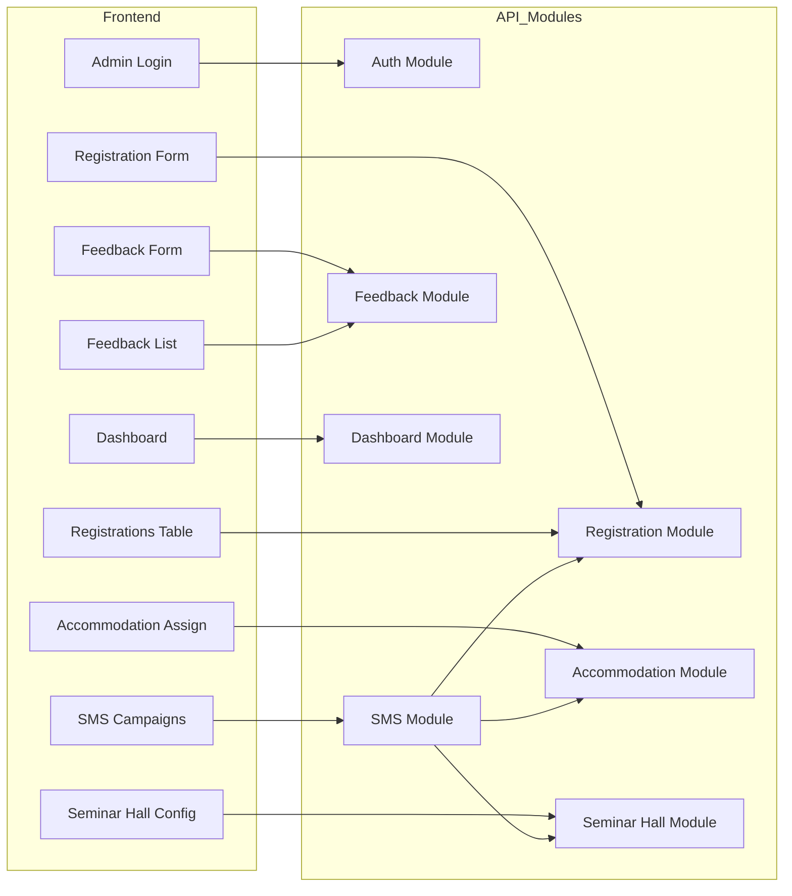
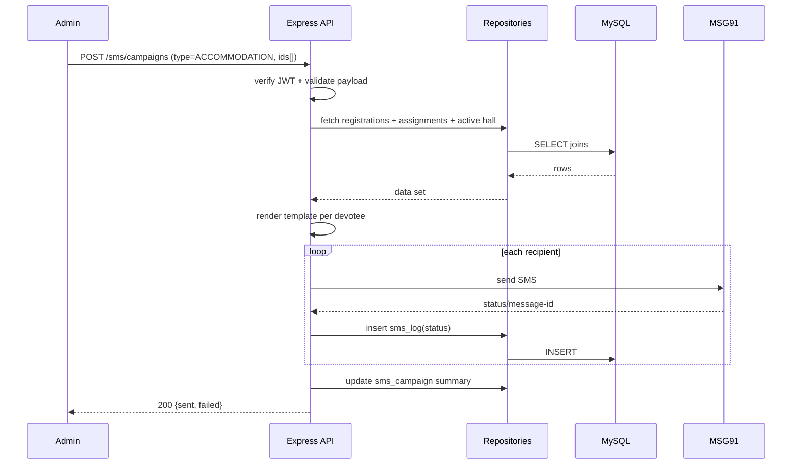
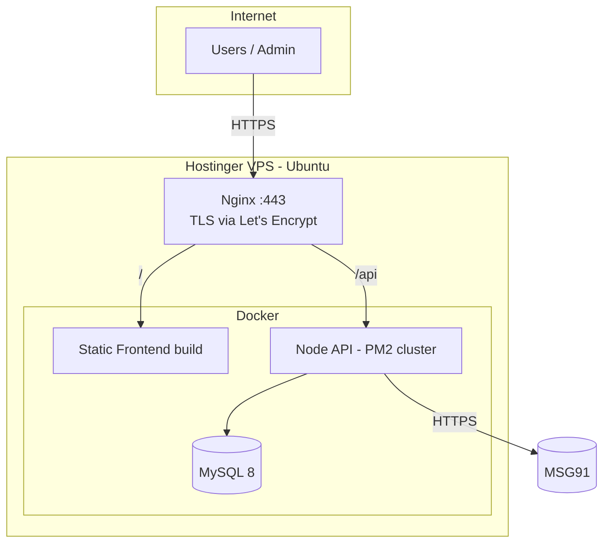

# PHASE 1 — System Analysis & Architecture

**Project:** SANGAMAHOTSAV.COM · Event Management Platform
**Scope (V1):** Devotee Registration · Admin Dashboard · Hotel/Room Assignment · Seminar Hall Config · Bulk SMS (MSG91) · Feedback
**Status:** Architecture only (no code). Proceed to Phase 2 after approval.

---

## 1. Functional Requirements

| ID | Module | Requirement |
|----|--------|-------------|
| FR-1 | Registration | Public user submits the registration form (all 20 fields) without login. |
| FR-2 | Registration | System validates and persists each registration with a unique ID + timestamp. |
| FR-3 | Auth | Admin authenticates via email + password (JWT). No public/devotee login. |
| FR-4 | Dashboard | Admin sees aggregate cards: total registrations, requiring stay, assigned rooms, pending assignments, SMS sent, feedback received. |
| FR-5 | Registration Mgmt | Admin can list, search, filter, paginate, view, edit, delete registrations. |
| FR-6 | Registration Mgmt | Admin can export registrations to Excel. |
| FR-7 | Accommodation | Admin assigns hotel name, address, room number, Google Map link to a registration. |
| FR-8 | Accommodation | Assignment status transitions Pending → Assigned. |
| FR-9 | Seminar Hall | Admin configures hall name, address, map link; exactly one active hall. |
| FR-10 | SMS | Admin triggers bulk SMS (Accommodation / 7-day / 2-day reminder) via MSG91. |
| FR-11 | SMS | System renders template with devotee + hotel + hall data and logs each send. |
| FR-12 | Feedback | Public user submits feedback (name, mobile, rating, suggestions) at `/feedback`. |
| FR-13 | Feedback | Admin can list, search, export feedback. |

## 2. Non-Functional Requirements

| Category | Requirement |
|----------|-------------|
| Performance | API p95 < 300 ms for CRUD; list endpoints paginated (default 20/page). |
| Scalability | Stateless API behind Nginx; horizontally scalable via PM2 cluster mode. |
| Security | JWT auth, bcrypt password hashing, input validation, rate limiting, Helmet, CORS allowlist, SQL injection safe (Sequelize parameterization), secrets via env. |
| Reliability | Global error handling, structured logging, SMS retry + failure logging. |
| Availability | Target 99.5%; PM2 auto-restart; Nginx reverse proxy. |
| Maintainability | Clean/layered architecture, SOLID, repository + service patterns. |
| Usability | Mobile-first responsive UI, accessible forms, clear validation messages. |
| Observability | Request logs, error logs, SMS campaign audit trail. |
| Compliance | Store minimal PII; mobile numbers protected; HTTPS/TLS enforced. |
| Portability | Dockerized; deployable to Hostinger VPS (Ubuntu + Nginx + PM2). |

## 3. Use Cases



**Primary use cases**

- **UC1 Register:** Devotee → validated form → persisted; confirmation shown.
- **UC5 Assign Accommodation:** Admin selects registration → enters hotel/room/map → status becomes Assigned.
- **UC7 Send SMS Campaign:** Admin selects SMS type + recipient set → system renders template → dispatches via MSG91 → logs per-recipient result.

## 4. User (Devotee) Journey



## 5. Admin Journey



## 6. High-Level Architecture



Single deployable frontend bundle (public + admin routes) served by Nginx; API is a stateless Express service; MySQL is the single source of truth; MSG91 is the only third-party runtime dependency.

## 7. Low-Level Architecture (Backend Layered / Clean Architecture)



**Layer responsibilities**

- **Routes:** map HTTP verbs/paths to controllers; attach middleware.
- **Middleware:** JWT verification, request validation, rate limiting, centralized error handler, request logging.
- **Controllers:** parse request, call service, format response. No business logic.
- **Services:** business rules, orchestration, transactions, template rendering.
- **Repositories:** all DB queries via Sequelize; isolates ORM from services.
- **Models:** Sequelize entities + associations.
- **Utils/Constants:** logger, response wrapper, enums (categories, SMS types, statuses).

## 8. Component Diagram



## 9. Data Flow Diagram

**DFD — SMS Accommodation Campaign (core flow)**



## 10. Folder Structure (proposed monorepo)

```
SANGAMAHOTSAV/
├── backend/
│   ├── src/
│   │   ├── config/        # env, db, logger, msg91
│   │   ├── controllers/
│   │   ├── services/
│   │   ├── repositories/
│   │   ├── routes/
│   │   ├── middleware/    # auth, validate, error, rateLimit
│   │   ├── models/        # sequelize models + index
│   │   ├── validators/
│   │   ├── utils/         # response, apiError, excel
│   │   ├── jobs/          # reserved (no scheduling in V1)
│   │   └── constants/     # enums, messages
│   ├── migrations/
│   ├── seeders/
│   ├── tests/
│   ├── .env.example
│   ├── Dockerfile
│   └── package.json
├── frontend/
│   ├── src/
│   │   ├── pages/         # public + admin
│   │   ├── components/    # shadcn/ui wrappers, shared
│   │   ├── features/      # registration, dashboard, sms, feedback
│   │   ├── lib/           # axios client, zod schemas
│   │   ├── hooks/
│   │   ├── routes/
│   │   └── layouts/
│   ├── public/
│   ├── index.html
│   ├── vite.config.ts
│   └── package.json
├── deploy/
│   ├── docker-compose.yml
│   ├── nginx/
│   ├── pm2/ecosystem.config.js
│   └── docs/ (VPS + SSL + backup guides)
└── README.md
```

## 11. API Strategy

- **Style:** REST, JSON, versioned under `/api/v1`.
- **Auth:** `Authorization: Bearer <JWT>`; admin routes protected by `authGuard`. Public routes: registration create, feedback create.
- **Response envelope:** `{ success, data, message, meta }`; errors `{ success:false, error:{ code, message, details } }`.
- **Pagination/Filter/Sort:** query params `?page=&limit=&search=&sortBy=&order=&filter[...]`.
- **Validation:** express-validator at boundary; Zod on frontend.
- **Rate limiting:** stricter limits on public POST endpoints.
- **Idempotency (SMS):** campaign records + per-recipient logs prevent silent double-charge; duplicates surfaced in response.

**Endpoint map (V1)**

| Method | Path | Access |
|--------|------|--------|
| POST | `/api/v1/auth/login` | Public |
| POST | `/api/v1/registrations` | Public |
| GET | `/api/v1/registrations` | Admin |
| GET | `/api/v1/registrations/:id` | Admin |
| PUT | `/api/v1/registrations/:id` | Admin |
| DELETE | `/api/v1/registrations/:id` | Admin |
| GET | `/api/v1/registrations/export` | Admin |
| POST | `/api/v1/accommodations/:registrationId` | Admin |
| PUT | `/api/v1/accommodations/:id` | Admin |
| GET | `/api/v1/seminar-halls` / `POST` / `PUT /:id` | Admin |
| POST | `/api/v1/sms/campaigns` | Admin |
| GET | `/api/v1/sms/campaigns` / `/logs` | Admin |
| POST | `/api/v1/feedbacks` | Public |
| GET | `/api/v1/feedbacks` / `/export` | Admin |
| GET | `/api/v1/dashboard/summary` | Admin |

## 12. Deployment Architecture



- **Nginx:** TLS termination, gzip, static serving, `/api` reverse proxy, security headers.
- **PM2:** cluster mode, auto-restart, log rotation, `ecosystem.config.js`.
- **Docker:** `docker-compose` for api + mysql (+ optional nginx); env via `.env`.
- **SSL:** Let's Encrypt (certbot), auto-renew.
- **Backups:** nightly `mysqldump` cron → retained/rotated; documented restore.

---

### Phase 1 Summary

Key architecture decisions: layered clean architecture, REST `/api/v1` with JWT admin auth, single-source MySQL, MSG91-only external dependency, Dockerized VPS deployment.

**Next:** Phase 2 — Database Design (ER diagram, relationships, index strategy, constraints, full table designs incl. the exact 20-field registration schema). No code until Phase 3.
