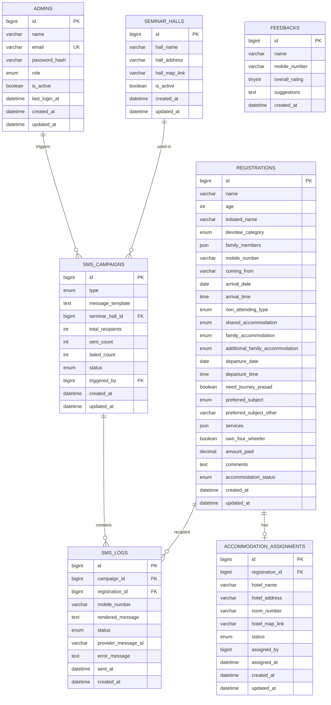

# PHASE 2 — Database Design

**Project:** SANGAMAHOTSAV.COM
**Engine:** MySQL 8 (InnoDB, `utf8mb4`, `utf8mb4_unicode_ci`)
**Scope:** Logical + physical design. Table designs, ER diagram, relationships, indexes, constraints. (DDL/Sequelize models come in Phase 3.)

---

## 1. ER Diagram

## 2. Table Relationships

| Relationship | Type | Notes |
|--------------|------|-------|
| `registrations` → `accommodation_assignments` | 1 : 0..1 | One registration has at most one active assignment. `registration_id` UNIQUE. |
| `admins` → `sms_campaigns` | 1 : N | `triggered_by` FK. |
| `seminar_halls` → `sms_campaigns` | 1 : N | Campaign snapshots the hall used. Nullable FK. |
| `sms_campaigns` → `sms_logs` | 1 : N | One log row per recipient. |
| `registrations` → `sms_logs` | 1 : N | A devotee may appear in multiple campaigns. |
| `feedbacks` | standalone | No FK; public submissions, not linked to registration in V1. |

## 3. Table Designs

### 3.1 `admins`
| Column | Type | Constraints |
|--------|------|-------------|
| id | BIGINT UNSIGNED | PK, AUTO_INCREMENT |
| name | VARCHAR(120) | NOT NULL |
| email | VARCHAR(160) | NOT NULL, UNIQUE |
| password_hash | VARCHAR(255) | NOT NULL (bcrypt) |
| role | ENUM('ADMIN') | NOT NULL, DEFAULT 'ADMIN' |
| is_active | BOOLEAN | NOT NULL, DEFAULT TRUE |
| last_login_at | DATETIME | NULL |
| created_at / updated_at | DATETIME | NOT NULL |

### 3.2 `registrations` (maps to the exact 20 form fields)
| # | Form Field | Column | Type | Constraints |
|---|-----------|--------|------|-------------|
| 1 | Name | name | VARCHAR(150) | NOT NULL |
| 1 | Age | age | INT UNSIGNED | NOT NULL, CHECK 0–120 |
| 1 | Initiated name | initiated_name | VARCHAR(150) | NULL |
| 2 | Devotee Category | devotee_category | ENUM('DISCIPLE','NON_DISCIPLE') | NOT NULL |
| 3 | Family members + age | family_members | JSON | NULL (array of `{name, age}`) |
| 4 | Mobile Number | mobile_number | VARCHAR(15) | NOT NULL, indexed |
| 5 | Coming From | coming_from | VARCHAR(150) | NOT NULL |
| 6 | Arrival Date | arrival_date | DATE | NULL |
| 7 | Arrival Time | arrival_time | TIME | NULL |
| 8 | Without Accommodation/Non-Attending | non_attending_type | ENUM('NON_ATTENDING_DISCIPLE','ATTENDING_NOT_STAYING') | NULL |
| 9 | Shared Accommodation | shared_accommodation | ENUM('DORMITORY','NON_AC_SHARING','AC_SHARING') | NULL |
| 10 | Family Accommodation | family_accommodation | ENUM('DELUXE_AC','PREMIUM_AC') | NULL |
| 11 | Additional Family Accommodation | additional_family_accommodation | ENUM('DELUXE','PREMIUM') | NULL |
| 12 | Departure Date | departure_date | DATE | NULL |
| 13 | Departure Time | departure_time | TIME | NULL |
| 14 | Need Journey Prasad | need_journey_prasad | BOOLEAN | NOT NULL, DEFAULT FALSE |
| 15 | Preferred Subject | preferred_subject | ENUM(13 values incl. 'OTHER') | NULL |
| 15 | Subject (Other text) | preferred_subject_other | VARCHAR(200) | NULL |
| 16 | Services (multi-select) | services | JSON | NULL (array of enum keys) |
| 17 | Own 4-wheeler | own_four_wheeler | BOOLEAN | NOT NULL, DEFAULT FALSE |
| 18 | Payment info (display only) | — | — | Not stored (static UI: PhonePe 7008920768 / Neeladri Bihari Dash) |
| 19 | Amount Paid | amount_paid | DECIMAL(10,2) | NULL, DEFAULT 0 |
| 20 | Comments | comments | TEXT | NULL |
| — | Derived assignment state | accommodation_status | ENUM('PENDING','ASSIGNED','NOT_REQUIRED') | NOT NULL, DEFAULT 'PENDING' |

**`preferred_subject` enum values:** `BHAGAVAD_GITA`, `SRIMAD_BHAGAVATAM`, `CHAITANYA_CHARITAMRITA`, `HARINAMA_CHINTAMANI`, `HOW_TO_STUDY_SB`, `HOW_TO_STUDY_CC`, `NECTAR_OF_INSTRUCTION`, `VAISHNAVA_ETIQUETTE`, `QA_SESSION`, `VAISHNAVA_SONGS`, `APARADHA`, `DEALING_WITH_VAISHNAVAS`, `OTHER`.

**`services` JSON** stores an array of stable keys from the 35 service options (e.g. `["KITCHEN_DEPARTMENT","KIRTAN","CAR_PARKING"]`). Enum key list is centralized in backend constants.

### 3.3 `accommodation_assignments`
| Column | Type | Constraints |
|--------|------|-------------|
| id | BIGINT UNSIGNED | PK, AUTO_INCREMENT |
| registration_id | BIGINT UNSIGNED | NOT NULL, FK → registrations(id), UNIQUE |
| hotel_name | VARCHAR(150) | NOT NULL |
| hotel_address | VARCHAR(255) | NOT NULL |
| room_number | VARCHAR(30) | NOT NULL |
| hotel_map_link | VARCHAR(500) | NULL (URL) |
| status | ENUM('PENDING','ASSIGNED') | NOT NULL, DEFAULT 'ASSIGNED' |
| assigned_by | BIGINT UNSIGNED | NULL, FK → admins(id) |
| assigned_at | DATETIME | NULL |
| created_at / updated_at | DATETIME | NOT NULL |

### 3.4 `seminar_halls`
| Column | Type | Constraints |
|--------|------|-------------|
| id | BIGINT UNSIGNED | PK, AUTO_INCREMENT |
| hall_name | VARCHAR(150) | NOT NULL |
| hall_address | VARCHAR(255) | NOT NULL |
| hall_map_link | VARCHAR(500) | NULL |
| is_active | BOOLEAN | NOT NULL, DEFAULT FALSE |
| created_at / updated_at | DATETIME | NOT NULL |

**Business rule:** only one row may have `is_active = TRUE`. Enforced by a partial-unique strategy (generated column `active_flag` = `1` when active else NULL, with a UNIQUE index) plus a service-layer transaction that deactivates others on activate.

### 3.5 `sms_campaigns`
| Column | Type | Constraints |
|--------|------|-------------|
| id | BIGINT UNSIGNED | PK, AUTO_INCREMENT |
| type | ENUM('ACCOMMODATION','REMINDER_7_DAY','REMINDER_2_DAY') | NOT NULL |
| message_template | TEXT | NOT NULL (snapshot of template used) |
| seminar_hall_id | BIGINT UNSIGNED | NULL, FK → seminar_halls(id) |
| total_recipients | INT UNSIGNED | NOT NULL, DEFAULT 0 |
| sent_count | INT UNSIGNED | NOT NULL, DEFAULT 0 |
| failed_count | INT UNSIGNED | NOT NULL, DEFAULT 0 |
| status | ENUM('PENDING','PROCESSING','COMPLETED','FAILED') | NOT NULL, DEFAULT 'PENDING' |
| triggered_by | BIGINT UNSIGNED | NOT NULL, FK → admins(id) |
| created_at / updated_at | DATETIME | NOT NULL |

### 3.6 `sms_logs`
| Column | Type | Constraints |
|--------|------|-------------|
| id | BIGINT UNSIGNED | PK, AUTO_INCREMENT |
| campaign_id | BIGINT UNSIGNED | NOT NULL, FK → sms_campaigns(id) |
| registration_id | BIGINT UNSIGNED | NULL, FK → registrations(id) |
| mobile_number | VARCHAR(15) | NOT NULL |
| rendered_message | TEXT | NOT NULL |
| status | ENUM('SENT','FAILED') | NOT NULL |
| provider_message_id | VARCHAR(100) | NULL (MSG91 id) |
| error_message | TEXT | NULL |
| sent_at | DATETIME | NULL |
| created_at | DATETIME | NOT NULL |

### 3.7 `feedbacks`
| Column | Type | Constraints |
|--------|------|-------------|
| id | BIGINT UNSIGNED | PK, AUTO_INCREMENT |
| name | VARCHAR(150) | NOT NULL |
| mobile_number | VARCHAR(15) | NOT NULL |
| overall_rating | TINYINT UNSIGNED | NOT NULL, CHECK 1–5 |
| suggestions | TEXT | NULL |
| created_at | DATETIME | NOT NULL |

## 4. Index Strategy

| Table | Index | Type | Purpose |
|-------|-------|------|---------|
| admins | `uk_admins_email` (email) | UNIQUE | Login lookup. |
| registrations | `idx_reg_mobile` (mobile_number) | BTREE | Search by mobile. |
| registrations | `idx_reg_status` (accommodation_status) | BTREE | Dashboard/pending filters. |
| registrations | `idx_reg_created` (created_at) | BTREE | Sorting/pagination. |
| registrations | `ft_reg_search` (name, coming_from) | FULLTEXT | Free-text admin search. |
| accommodation_assignments | `uk_acc_registration` (registration_id) | UNIQUE | One assignment per registration. |
| accommodation_assignments | `idx_acc_status` (status) | BTREE | Filter assigned/pending. |
| seminar_halls | `uk_hall_active` (active_flag) | UNIQUE | Enforce single active hall. |
| sms_campaigns | `idx_camp_type` (type), `idx_camp_created` (created_at) | BTREE | Listing/filtering. |
| sms_logs | `idx_log_campaign` (campaign_id) | BTREE | Fetch logs per campaign. |
| sms_logs | `idx_log_status` (status) | BTREE | Failure reporting. |
| sms_logs | `idx_log_mobile` (mobile_number) | BTREE | Recipient history. |
| feedbacks | `idx_fb_mobile` (mobile_number), `idx_fb_created` (created_at) | BTREE | Search + sort. |

## 5. Constraints & Integrity Rules

- **Primary keys:** `BIGINT UNSIGNED AUTO_INCREMENT` on every table.
- **Foreign keys (InnoDB):**
  - `accommodation_assignments.registration_id` → `registrations.id` `ON DELETE CASCADE`.
  - `accommodation_assignments.assigned_by` → `admins.id` `ON DELETE SET NULL`.
  - `sms_campaigns.triggered_by` → `admins.id` `ON DELETE RESTRICT`.
  - `sms_campaigns.seminar_hall_id` → `seminar_halls.id` `ON DELETE SET NULL`.
  - `sms_logs.campaign_id` → `sms_campaigns.id` `ON DELETE CASCADE`.
  - `sms_logs.registration_id` → `registrations.id` `ON DELETE SET NULL`.
- **Check constraints:** `age` 0–120; `overall_rating` 1–5; `amount_paid >= 0`.
- **Unique:** admin email; one assignment per registration; single active seminar hall.
- **Enums:** all fixed-option fields use ENUM (DB-level) mirrored by backend constants for a single source of truth.
- **Timestamps:** `created_at`/`updated_at` on mutable tables; `created_at` only on append-only `sms_logs` and `feedbacks`.
- **Charset/Collation:** `utf8mb4` throughout for names/comments and future multilingual content.

## 6. Data Lifecycle & Notes

- **Soft state vs hard delete:** `registrations` delete cascades to its assignment and nulls related SMS logs (audit preserved via `mobile_number` snapshot).
- **Snapshots for auditability:** `sms_campaigns.message_template` and `sms_logs.rendered_message` store the exact text sent, independent of later template edits.
- **PII minimization:** only mobile number + name are the sensitive fields; no payment card data stored (PhonePe details are display-only).
- **JSON vs child tables:** `family_members` and `services` use JSON for V1 simplicity; can be normalized later if reporting needs grow.

---

### Phase 2 Summary

Seven tables designed with full column specs, relationships, indexes, FK actions, and check constraints. The `registrations` table maps 1:1 to the required 20 form fields, with ENUMs + JSON for multi-option fields and a single-active-hall constraint on `seminar_halls`.

**Next:** Phase 3 — Database Implementation (MySQL DDL, foreign keys, indexes, Sequelize models + associations, migrations, seed data).
